# Realm

> **Inference Orchestration Runtime for Multi-Tenant LLM Deployments**

[](https://github.com/querent-ai/realm/actions)
[](LICENSE)
[](https://www.rust-lang.org)

Realm is an **inference orchestration system** that enables 16 isolated customers to share a single GPU efficiently. By orchestrating inference through WASM sandboxes and native compute, Realm achieves **16x density** while maintaining security and performance guarantees for each tenant.

## 🎯 Quick Start

### Run the Paris Example

```bash
# Clone and build
git clone https://github.com/realm-ai/realm.git
cd realm
cargo build --release

# Run simulation mode (validates architecture)
./target/release/paris-generation

# Run with real TinyLlama model
./target/release/paris-generation models/tinyllama-1.1b.Q4_K_M.gguf
```

**Expected output:**
```
🗼 Realm Paris Generation Example
   Question: What is the capital of France?
   Expected: Paris

✨ Response: Paris

✅ SUCCESS: Model correctly identified Paris as the capital of France!
```

## 🏗️ Inference Orchestration Architecture

### How Realm Orchestrates Inference Across Tenants

```mermaid
graph TB
    subgraph "Tenant Layer (Isolated WASM Sandboxes)"
        T1["🔒 Tenant 1<br/>WASM (42KB)<br/>State (52KB)"]
        T2["🔒 Tenant 2<br/>WASM (42KB)<br/>State (52KB)"]
        T3["🔒 Tenant 3<br/>WASM (42KB)<br/>State (52KB)"]
        T16["🔒 Tenant 16<br/>WASM (42KB)<br/>State (52KB)"]

        T1 -.-> T2
        T2 -.-> T3
        T3 -.-> T16
    end

    subgraph "Host Runtime (Shared Infrastructure)"
        subgraph "Wasmtime (WASM Host)"
            HF["Host Functions<br/>• candle_matmul<br/>• memory64_load_layer<br/>• memory64_read"]
        end

        subgraph "Memory64 Storage"
            M64["Model Weights (4.3GB)<br/>📦 Shared, Read-Only<br/>On-demand Layer Loading"]
        end

        subgraph "Compute Backends"
            GPU["🎮 GPU Backend<br/>CUDA / Metal / WebGPU"]
            CPU["💻 CPU Backend<br/>SIMD / Candle"]
        end
    end

    T1 -->|"generate('Hello')"| HF
    T2 -->|"generate('Hi')"| HF
    T3 -->|"generate('Hey')"| HF
    T16 -->|"generate('Bonjour')"| HF

    HF -->|Load Layer| M64
    HF -->|Compute| GPU
    HF -->|Fallback| CPU

    M64 -.->|Layer Data| HF
    GPU -.->|Result| HF
    CPU -.->|Result| HF

    HF -.->|Response| T1
    HF -.->|Response| T2
    HF -.->|Response| T3
    HF -.->|Response| T16

    style T1 fill:#e1f5ff,stroke:#0288d1
    style T2 fill:#e1f5ff,stroke:#0288d1
    style T3 fill:#e1f5ff,stroke:#0288d1
    style T16 fill:#e1f5ff,stroke:#0288d1
    style HF fill:#fff3e0,stroke:#f57c00
    style M64 fill:#f3e5f5,stroke:#7b1fa2
    style GPU fill:#e8f5e9,stroke:#388e3c
    style CPU fill:#e8f5e9,stroke:#388e3c
```



**Orchestration Benefits:**
- 🎯 **Efficient Resource Scheduling:** 16 tenants share GPU compute without interference
- 📊 **Dynamic Memory Management:** On-demand model layer loading via Memory64
- 🔒 **Isolated Inference Execution:** Each tenant runs in a secure WASM sandbox
- ⚡ **95% GPU Utilization:** vs 60% traditional = **16x density improvement**

### Why This Architecture?

Traditional LLM inference faces three critical orchestration challenges:

#### 1. **Inefficient Resource Utilization**
- **Problem:** Each tenant gets a dedicated VM/container with its own model copy (4.3GB)
- **Realm's Solution:** WASM sandboxes (42KB) orchestrate inference through shared host functions
- **Impact:** 16 tenants fit in memory that previously held 1 tenant

#### 2. **GPU Under-utilization**
- **Problem:** Single-tenant inference leaves GPU idle 40% of the time during I/O and memory ops
- **Realm's Solution:** Orchestrator schedules inference across 16 tenants, keeping GPU busy
- **Impact:** 95% GPU utilization through intelligent work distribution

#### 3. **Security vs Efficiency Trade-off**
- **Problem:** VMs provide isolation but waste resources; shared processes risk data leakage
- **Realm's Solution:** WASM provides lightweight isolation enforced at the instruction level
- **Impact:** Security guarantees without the overhead of traditional virtualization

**The Result:** An orchestration layer that treats inference as a schedulable, isolated workload—like Kubernetes for inference, but at the WASM sandbox level.

See [ARCHITECTURE.md](docs/ARCHITECTURE.md) for detailed design.

## 🚀 Orchestration Capabilities

### Inference Workload Management
- ✅ **Tenant Isolation** - Each inference session runs in a secure WASM sandbox
- ✅ **Resource Scheduling** - Orchestrates 16 tenants across shared GPU compute
- ✅ **Dynamic Memory Allocation** - Memory64 enables on-demand model layer loading
- ✅ **Streaming Generation** - Token-by-token inference with KV cache optimization

### Model & Backend Support
- ✅ **GGUF Models** - Orchestrate inference for quantized models (Q4_K, Q5_K, Q6_K, Q8_K)
- ✅ **Multi-Backend Execution** - Schedule workloads across CUDA, Metal, WebGPU, or CPU
- ✅ **Large Model Support** - Orchestrate models >4GB through Memory64 architecture

### Production Features
- ✅ **Zero-Copy Model Sharing** - All tenants reference the same model weights
- ✅ **Fair Scheduling** - No tenant can monopolize GPU resources
- ✅ **Failure Isolation** - One tenant's crash doesn't affect others

## 📦 Repository Structure

```
realm/
├── crates/
│   ├── realm-core/          # Model loading (GGUF), tokenization, quantization
│   ├── realm-models/        # Inference primitives (attention, FFN, sampling)
│   ├── realm-compute-cpu/   # CPU execution backends (SIMD, Candle)
│   ├── realm-compute-gpu/   # GPU execution backends (CUDA, Metal, WebGPU)
│   ├── realm-runtime/       # Orchestration runtime (Memory64, Wasmtime, host functions)
│   └── realm-wasm/          # WASM inference orchestrator (tenant-side logic)
├── examples/                # Orchestration examples
│   ├── paris-generation/    # End-to-end orchestrated inference demo
│   ├── simple-realm-test/   # Basic orchestration validation
│   ├── multi-tenant/        # 16-tenant orchestration example
│   └── end-to-end-inference/# Complete inference pipeline
├── models/                  # GGUF model files (symlinks to model storage)
└── docs/                    # Orchestration architecture & design docs
```

## 🛠️ Building

### Prerequisites

- **Rust 1.75+**
- **wasm-pack** (for WASM builds)
- **CUDA 11.8+** (optional, for NVIDIA GPUs)
- **macOS 12.0+** (optional, for Metal/Apple Silicon)

```bash
# Install Rust
curl --proto '=https' --tlsv1.2 -sSf https://sh.rustup.rs | sh

# Install WASM tooling
rustup target add wasm32-unknown-unknown
curl https://rustwasm.github.io/wasm-pack/installer/init.sh -sSf | sh
```

### Build Commands

```bash
# Build all crates (native)
cargo build --release

# Build WASM module
cd crates/realm-wasm
wasm-pack build --target web

# Build with CUDA support
cargo build --release --features cuda

# Build with Metal support (macOS)
cargo build --release --features metal
```

## 🧪 Testing

```bash
# Run all tests
cargo test --workspace

# Run simple integration test
cargo run --release --bin simple-realm-test

# Run multi-tenant example
cargo run --release --bin multi-tenant

# Run with real model
cargo run --release --bin paris-generation models/tinyllama-1.1b.Q4_K_M.gguf
```

## 📖 Examples

### 1. Simple Integration Test

Validates basic WASM ↔ Host integration:

```bash
cargo run --release --bin simple-realm-test
```

### 2. Paris Generation (End-to-End)

Complete inference pipeline from prompt → response:

```bash
# Simulation mode (fast, validates architecture)
./target/release/paris-generation

# Real model inference
./target/release/paris-generation models/tinyllama-1.1b.Q4_K_M.gguf
```

### 3. Multi-Tenant Demo

Shows multiple isolated tenants sharing one GPU:

```bash
cargo run --release --bin multi-tenant
```

## 📚 Documentation

- **[Architecture](docs/ARCHITECTURE.md)** - System design and technical details
- **[GPU Backends](docs/GPU_BACKENDS.md)** - CUDA, Metal, WebGPU integration
- **[Product & Economics](PRODUCT_AND_ECONOMICS.md)** - Business value and cost savings
- **[Production Status](PRODUCTION_STATUS.md)** - What's ready for production
- **[Contributing](CONTRIBUTING.md)** - How to contribute

## 🎯 Models

Download and set up models:

```bash
# Create models directory with symlinks
mkdir -p models
cd models

# Download TinyLlama (638 MB)
wget https://huggingface.co/TheBloke/TinyLlama-1.1B-Chat-v1.0-GGUF/resolve/main/tinyllama-1.1b-chat-v1.0.Q4_K_M.gguf \
  -O tinyllama-1.1b.Q4_K_M.gguf

# Or symlink from Ollama
ln -s ~/.ollama/models/tinyllama-1.1b.Q4_K_M.gguf .
```

See [models/README.md](models/README.md) for full model documentation.

## 🔧 Orchestration Components

| Crate | Role in Orchestration | Status |
|-------|----------------------|--------|
| `realm-core` | Model format support for orchestrated workloads | ✅ Production |
| `realm-models` | Inference execution primitives | ✅ Production |
| `realm-compute-cpu` | CPU execution backend for scheduled work | ✅ Production |
| `realm-compute-gpu` | GPU execution backend for scheduled work | ⚠️ Needs validation |
| `realm-runtime` | **Core orchestration runtime** - schedules & isolates inference | ✅ Production |
| `realm-wasm` | Tenant-side orchestration client | ✅ Production |

## 📊 Orchestration Performance

See [PRODUCT_AND_ECONOMICS.md](PRODUCT_AND_ECONOMICS.md) for detailed benchmarks and cost analysis.

**Orchestration efficiency (7B model, A100 GPU):**

| Metric | Traditional (1:1) | Realm Orchestration | Improvement |
|--------|-------------------|---------------------|-------------|
| Concurrent tenants | 1 | 16 | **16x density** |
| Memory per tenant | 4.3GB | 52KB + shared model | **~84x reduction** |
| GPU utilization | ~60% (idle time) | ~95% (scheduled) | **58% more work** |
| Orchestration overhead | N/A | <5% per tenant | Minimal impact |

## 🤝 Contributing

We welcome contributions to improve Realm's orchestration capabilities! Please see [CONTRIBUTING.md](CONTRIBUTING.md) for guidelines.

**High-impact areas:**
- **Orchestration Algorithms** - Improve scheduling, resource allocation, and fairness
- **Backend Optimization** - Validate and optimize GPU backends (CUDA, Metal, WebGPU)
- **Orchestration Metrics** - Add observability, performance tracking, and tenant analytics
- **Model Support** - Extend orchestration to additional model architectures
- **Production Hardening** - Testing, benchmarking, and real-world deployment validation

## 📄 License

Licensed under either of:

- Apache License, Version 2.0 ([LICENSE-APACHE](LICENSE-APACHE) or http://www.apache.org/licenses/LICENSE-2.0)
- MIT License ([LICENSE-MIT](LICENSE-MIT) or http://opensource.org/licenses/MIT)

at your option.

### Contribution

Unless you explicitly state otherwise, any contribution intentionally submitted for inclusion in the work by you, as defined in the Apache-2.0 license, shall be dual licensed as above, without any additional terms or conditions.

## 🙏 Acknowledgments

Built on excellent work from:
- [llama.cpp](https://github.com/ggerganov/llama.cpp) - GGUF format and quantization
- [Candle](https://github.com/huggingface/candle) - ML framework with GPU support
- [Wasmtime](https://github.com/bytecodealliance/wasmtime) - High-performance WASM runtime
- [wasm-bindgen](https://github.com/rustwasm/wasm-bindgen) - Rust/WASM interop

---

**🌐 Production-grade inference orchestration for multi-tenant LLM deployments**
